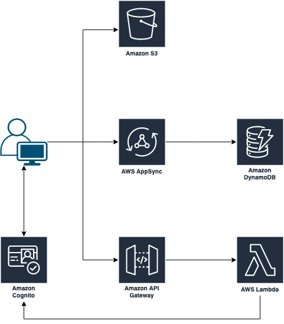
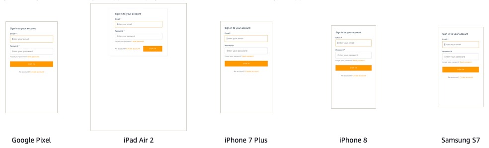
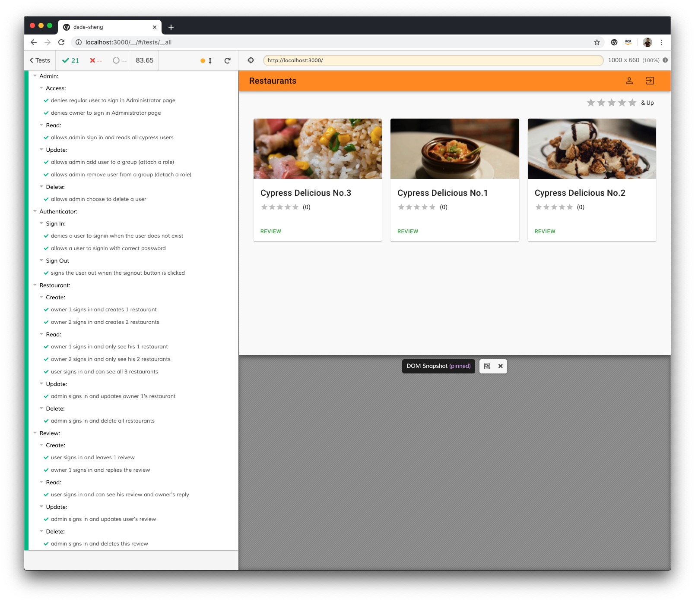
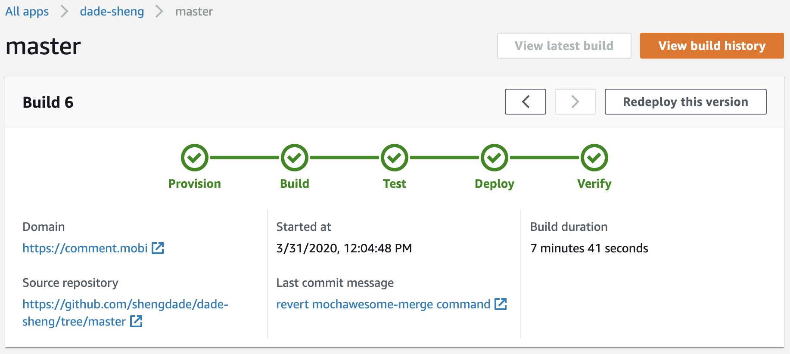

# Requirements

Write an application to Review Restaurants

- User must be able to create an account and log in. (If a mobile application, this means that more users can use the app from the same phone).
- Implement 3 roles with different permission levels
  - Regular User: Can rate and leave a comment for a restaurant
  - Owner: Can create restaurants and reply comments about owned restaurants
  - Admin: Can edit/delete all users, restaurants, comments, and reviews
- Reviews should have:
  - A 5 star based rate
  - Date of the visit
  - Comment
- When a Regular User logs in he will see a Restaurant List ordered by Rate Average
- When an Owner logs in he will see a Restaurant List only the ones owned by him, and the reviews pending to reply
- Owners can reply the review once
- Restaurants detailed view should have:
  - The overall average rating
  - The highest rated review
  - The lowest rated review
  - Last reviews with rate, comment, and reply
- Restaurant List can be filtered by Rating
- REST API. Make it possible to perform all user actions via the API, including authentication (If a mobile application and you don’t know how to create your own backend you can use Firebase.com or similar services to create the API).
- In any case, you should be able to explain how a REST API works and demonstrate that by creating functional tests that use the REST Layer directly. Please be prepared to use REST clients like Postman, cURL, etc. for this purpose.
- If it’s a web application, it must be a single-page application. All actions need to be done client side using AJAX, refreshing the page is not acceptable. (If a mobile application, disregard this).
- Functional UI/UX design is needed. You are not required to create a unique design, however, do follow best practices to make the project as functional as possible.
- Bonus: unit and e2e tests.

# Website

https://www.comment.mobi/

Test User:

- Email: `user@comment.mobi`
- Password: `1234567890`

## Permission

### Restaurant

| role  | create | read | update | delete |
| ----- | ------ | ---- | ------ | ------ |
| User  | x      | ✓    | x      | x      |
| Owner | ✓      | ✓    | x      | x      |
| Admin | x      | ✓    | ✓      | ✓      |

### Review

| role  | create | read | update | delete |
| ----- | ------ | ---- | ------ | ------ |
| User  | ✓      | ✓    | x      | x      |
| Owner | x      | ✓    | x      | x      |
| Admin | x      | ✓    | ✓      | ✓      |

# Features

## Serverless Architecture

  

## Responsive UI

  

## End-to-end Testing

Test Results can be found on Cypress Dashboard - https://dashboard.cypress.io/projects/2n4con/

  

## Continuous Deployment

  

